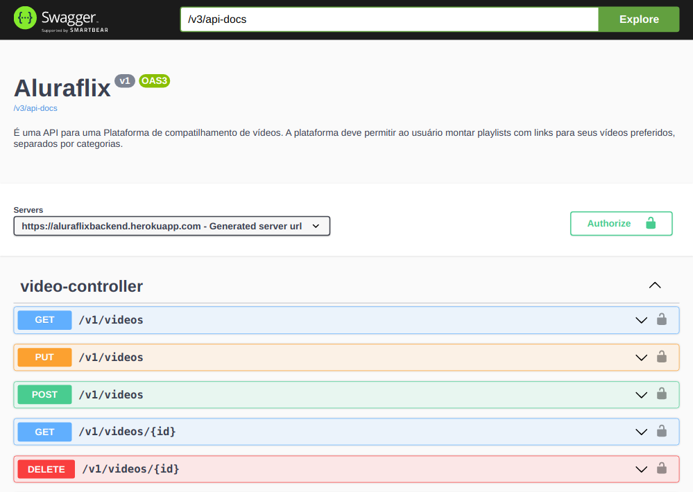

# Aluraflix
<p>
    
    <a href="https://github.com/my-study-area">
        
    </a>
    
    <a href="https://github.com/EliasGcf/readme-template/commits/master">
    
    </a>
</p>

Aluraflix é uma implementação de uma `API REST` desenvolvida durante o **Alura Challenge Back-End** da Alura.

## Sobre
É uma API para uma Plataforma de compatilhamento de vídeos. A plataforma deve permitir ao usuário montar playlists com links para seus vídeos preferidos, separados por categorias.

### Tecnologias
- Java
- Spring Boot
- Spring Data
- Spring Boot Developer Tools
- Spring Docs
- H2 Database
- PostgreSQL
- Docker e Docker Compose
- Junit Jupiter
- Hibernate
- Jakarta Validator

## Começando
```bash
# clone o projeto
git clone https://github.com/adrianoavelino/aluraflix.git

# entre no diretório
cd aluraflix
```
Para inicializar a aplicação utilizando docker-compose:
```bash
# inicie a aplicação
docker-compose up -d
```
Para inicialalizar a aplicação no container, no ambiente de produção, utilizando docker, execute os seguintes passos, após clonar e entrar no diretório da aplicação:
```bash
# gera o jar da aplicação
./mvnw clean package -DskipTests

# gera a imagem docker da aplicação
docker build -t adrianoavelino/aluraflix:1 .

# inicia o container do banco de dados
docker-compose up -d db

# inicia a aplicação no docker
docker run -it -p 8080:8080 \
-e SPRING_PROFILES_ACTIVE='prod' \
-e DATASOURCE_URL='jdbc:postgresql://db:5432/aluraflix' \
-e DATASOURCE_USERNAME='adriano' \
-e DATASOURCE_PASSWORD='adriano' \
-e JWT_SECRET='123456' \
-e JWT_EXPIRATION='8640000' \
-e SERVER_PORT='8080' \
--network=aluraflix_default adrianoavelino/aluraflix:1
```

Para inicializar a aplicação, utilizando live reload, em sua IDE:
- configure as variáveis de ambiente:

|Nome                   |Valor                                      |
|-----------------------|-------------------------------------------|
|SPRING_PROFILES_ACTIVE | prod                                      |
|DATASOURCE_URL         | jdbc:postgresql://localhost:5432/aluraflix|
|DATASOURCE_USERNAME    | adriano                                   |
|DATASOURCE_PASSWORD    | adriano                                   |
|DATASOURCE_DATABASE    | aluraflix                                 |
|JWT_SECRET             |123456                                     |
|JWT_EXPIRATION         |8640000                                    |
|SERVER_PORT            |8080                                       |

- inicie o banco de dados:
```bash
# inicia o container do banco de dados
docker-compose up -d db
```
Agora bastar iniciar a aplicação utilizando a classe `src/main/java/br/com/alura/aluraflix/AluraflixApplication.java`.

### Outras informações
Para acessar o banco de dados via linha de comando no docker execute:
```bash
# acessa o banco de dados na linha de comando
docker-compose exec db mysql -u adriano -p
```
Usuário e senha do banco de dados:
|Usuário|Senha  |
--------|----   |
|adriano|adriano|

### Documentação
A documentação da API está disponível [localmente](http://localhost:8080/swagger-ui.html) ou na aplicação online no [Heroku](https://aluraflixbackend.herokuapp.com/swagger-ui.html).




## Testes

### Testes automatizados

O testes autopmatizados podem ser executados em três ambientes: `localmente`, via `docker` ou `docker-compose`:

### Testes no ambiente local

> antes de executar os teste inicie o container do banco de dados com o comando `docker-compose up -d db`

Comando para executar os testes no terminal:

- Testes de Repository:
```bash
# VideoRepositoryTest
./mvnw test -Dspring.datasource.url=jdbc:h2:mem:testaluraflix \
-Dspring.datasource.username=sa \
-Dspring.datasource.password= \
-Dforum.jwt.secret=123456 \
-Dforum.jwt.expiration=8640000 \
-Dtest=br.com.alura.aluraflix.repository.VideoRepositoryTest -e
```
```bash
# CategoriaRepositoryTest
./mvnw test -Dspring.datasource.url=jdbc:h2:mem:testaluraflix \
-Dspring.datasource.username=sa \
-Dspring.datasource.password= \
-Dforum.jwt.secret=123456 \
-Dforum.jwt.expiration=8640000 \
-Dtest=br.com.alura.aluraflix.repository.CategoriaRepositoryTest -e
```
- VideoController:
```bash
# VideoControllerTest
./mvnw test -Dspring.datasource.url=jdbc:h2:mem:testaluraflix \
-Dspring.datasource.username=sa \
-Dspring.datasource.password= \
-Dforum.jwt.secret=123456 \
-Dforum.jwt.expiration=8640000 \
-Dtest=br.com.alura.aluraflix.controller.VideoControllerTest -e
```

```bash
# CategoriaControllerTest
./mvnw test -Dspring.datasource.url=jdbc:h2:mem:testaluraflix \
-Dspring.datasource.username=sa \
-Dspring.datasource.password= \
-Dforum.jwt.secret=123456 \
-Dforum.jwt.expiration=8640000 \
-Dtest=br.com.alura.aluraflix.controller.CategoriaControllerTest -e
```

### Testes via docker
> antes de executar os teste inicie o container do banco de dados com o comando `docker-compose up -d db`

```bash
# gera a imagem docker da aplicação
docker build -t adrianoavelino/aluraflix_test:latest . -f Dockerfile-test

# executa os testes
docker run -it -v /tmp/m2docker:/root/.m2 \
-v /tmp/m2docker:/root/.m2 \
-e SPRING_DATASOURCE_URL='jdbc:h2:mem:testaluraflix' \
-e SPRING_DATASOURCE_USERNAME='sa' \
-e SPRING_DATASOURCE_PASSWORD='' \
-e FORUM_JWT_SECRET='123456' \
-e FORUM_JWT_EXPIRATION='8640000' \
--network=aluraflix_default adrianoavelino/aluraflix_test:latest
```

### Testes via docker-compose
```bash
docker-compose -f docker-compose-test.yml up --build
```

### Testes manuais
- GET `/v1/videos`:
```bash
curl --location --request GET 'http://localhost:8080/v1/videos'
```
Exemplo de reposta:
```json
{
    "content": [
        {
            "id": 2,
            "titulo": "Mysql",
            "descricao": "Do básico ao avançado com Mysql",
            "url": "https://www.meusite.com.br/mysql"
        },
        {
            "id": 3,
            "titulo": "Docker",
            "descricao": "Primeiros passos com docker",
            "url": "https://www.meusite.com.br/docker"
        }
    ],
    "pageable": {
        "sort": {
            "sorted": false,
            "unsorted": true,
            "empty": true
        },
        "pageNumber": 0,
        "pageSize": 20,
        "offset": 0,
        "paged": true,
        "unpaged": false
    },
    "totalPages": 1,
    "totalElements": 2,
    "last": true,
    "sort": {
        "sorted": false,
        "unsorted": true,
        "empty": true
    },
    "number": 0,
    "first": true,
    "numberOfElements": 2,
    "size": 20,
    "empty": false
}
```
- GET `/v1/videos/{id}`:
```bash
curl --location --request GET 'http://localhost:8080/v1/videos/1'
```

Exemplo de reposta:
```json
{
    "id": 1,
    "titulo": "Domain Driven Design com Alberto Sousa, o Dev Eficiente",
    "descricao": "Domain Driven Design, o que ? Por que foi criada e qual objetivo dessa linguagem dentro da programao?",
    "url": "https://www.youtube.com/watch?v=n40Z1c9Ryog"
}
```
- POST `/v1/videos`:
```bash
curl --location --request POST 'http://localhost:8080/v1/videos' \
--header 'Content-Type: application/json' \
--data-raw '{
    "titulo": "Algumas Dicas de CSS",
    "descricao": "Dicas de uso de SASS e especificadade CSS",
    "url": "https://youtu.be/bOdrGg5oc3E"
}'
```
Exemplo de reposta:
```json
{
    "id": 4,
    "titulo": "Algumas Dicas de CSS",
    "descricao": "Dicas de uso de SASS e especificadade CSS",
    "url": "https://youtu.be/bOdrGg5oc3E"
}
```
- PUT `/v1/videos/{id}`:
```bash
curl --location --request PUT 'http://localhost:8080/v1/videos' \
--header 'Content-Type: application/json' \
--data-raw '{
    "id": 22,
    "titulo": "Atualizado Domain Driven Design com Alberto Sousa, o Dev Eficiente",
    "descricao": "Atualizado Domain Driven Design, o que ? Por que foi criada e qual objetivo dessa linguagem dentro da programao?",
    "url": "https://www.youtube.com/watch?v=atualizado"
}'
```
- DELETE `/v1/videos/{id}`:
```bash
curl --location --request DELETE 'http://localhost:8080/v1/videos/1' \
--data-raw ''
```
